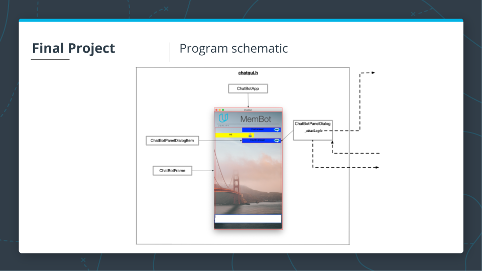

# Memory Management Chatbot

This project builds a Chatbot with proper C++ memory management on the code.

The stater code for the project is taken from the [GitHub Repo](https://github.com/udacity/CppND-Memory-Management-Chatbot).

The ChatBot code creates a dialogue where users can ask questions about some aspects of memory management in C++. After the knowledge base of the chatbot has been loaded from a text file, a knowledge graph representation is created in computer memory, where chatbot answers represent the graph nodes and user queries represent the graph edges. After a user query has been sent to the chatbot, the Levenshtein distance is used to identify the most probable answer.

The code makes use of  smart pointers, move semantics and ownership or memory allocation.

## Project Program Schematics

The below images show the program schematics for the project.

## Dependencies for Running Locally
* cmake >= 3.11
  * All OSes: [click here for installation instructions](https://cmake.org/install/)
* make >= 4.1 (Linux, Mac), 3.81 (Windows)
  * Linux: make is installed by default on most Linux distros
  * Mac: [install Xcode command line tools to get make](https://developer.apple.com/xcode/features/)
  * Windows: [Click here for installation instructions](http://gnuwin32.sourceforge.net/packages/make.htm)
* gcc/g++ >= 5.4
  * Linux: gcc / g++ is installed by default on most Linux distros
  * Mac: same deal as make - [install Xcode command line tools](https://developer.apple.com/xcode/features/)
  * Windows: recommend using [MinGW](http://www.mingw.org/)
* wxWidgets >= 3.0
  * Linux: `sudo apt-get install libwxgtk3.0-dev libwxgtk3.0-0v5-dbg`
  * Mac: There is a [homebrew installation available](https://formulae.brew.sh/formula/wxmac).
  * Installation instructions can be found [here](https://wiki.wxwidgets.org/Install). Some version numbers may need to be changed in instructions to install v3.0 or greater.

## Basic Build Instructions

1. Clone this repo.
2. Make a build directory in the top level directory: `mkdir build && cd build`
3. Compile: `cmake .. && make`
4. Run it: `./membot`.

## Project Memory Management Details

### Exclusive Ownership 1
In file `chatgui.h` / `chatgui.cpp`, `_chatLogic` is an exclusive resource to class `ChatbotPanelDialog` using a smart pointer. 

### The Rule Of Five
In file `chatbot.h` / `chatbot.cpp`, the class `ChatBot` complies with the Rule of Five.

### Exclusive Ownership 2
In file `chatlogic.h` / `chatlogic.cpp`, the vector `_nodes` adapts in a way that the instances of `GraphNodes` to which the vector elements refer are exclusively owned by the class `ChatLogic`.

### Moving Smart Pointers

In files `chatlogic.h` / `chatlogic.cpp` and `graphnodes.h` / `graphnodes.cpp` the ownership of all instances of `GraphEdge` is such that each instance of `GraphNode` exclusively owns the outgoing `GraphEdges` and holds non-owning references to incoming `GraphEdges`.

### Moving the ChatBot

In file `chatlogic.cpp`, a local `ChatBot` instance is created on the stack at the bottom of function `LoadAnswerGraphFromFile`. Then, move semantics are used to pass the `ChatBot` instance into the root node. 